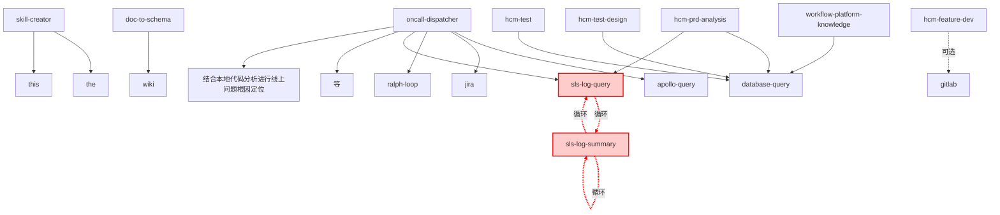

# SKILL 依赖关系分析报告

生成时间：2026-03-05 17:54:54
分析模式：全量分析

## 1. 执行摘要

- 总 SKILL 数：63
- 依赖关系数：18
- 检测到循环：⚠️ 2
- 多路径 SKILL 对：0
- 孤立 SKILL：43

## 2. 依赖关系分析

### 2.1 概览统计

- 平均入度：0.29
- 平均出度：0.29
- 图密度：0.005
- 最长调用链：2 层

### 2.2 依赖图可视化

#### ASCII 树形图（Top 5 核心 SKILL）

```

oncall-dispatcher (出度: 6)
├── apollo-query
├── jira
├── ralph-loop
├── sls-log-query
│   └── sls-log-summary
│       ├── sls-log-query
│       └── sls-log-summary
├── 等
└── 结合本地代码分析进行线上问题根因定位

sls-log-summary (出度: 2)
├── sls-log-query
│   └── sls-log-summary
└── sls-log-summary

skill-creator (出度: 2)
├── the
└── this

hcm-prd-analysis (出度: 2)
├── database-query
└── sls-log-query
    └── sls-log-summary
        ├── sls-log-query
        └── sls-log-summary

hcm-test (出度: 1)
└── database-query
```

#### Mermaid Flowchart（依赖关系图）



**图例说明**：
- 实线箭头：强依赖（必须调用）
- 虚线箭头：可选依赖（条件调用）
- 红色节点和边：循环依赖（需要修复）

**在线编辑器**（可复制 Mermaid 代码到以下网站查看和编辑）：
- [Mermaid Live Editor](https://mermaid.live/) - 官方编辑器
- [Mermaid Viewer](https://mermaidviewer.com/) - 实时预览 + AI 辅助
- [ProcessOn Mermaid](https://www.processon.com/mermaid) - 中文界面 + AI 识图

### 2.3 循环依赖分析

⚠️ **检测到 2 个循环依赖**

#### 🔴 高危循环（强依赖）：2 个

**循环 1**
- 路径：`sls-log-summary → sls-log-summary`
- 风险等级：🔴 高危
- 影响：可能导致无限递归调用，系统崩溃
- 依赖证据：
  - **sls-log-summary → sls-log-summary**：# Step 2: 生成总结并上传Wiki（使用 sls-log-summary skill）

**循环 2**
- 路径：`sls-log-query → sls-log-summary → sls-log-query`
- 风险等级：🔴 高危
- 影响：可能导致无限递归调用，系统崩溃
- 依赖证据：
  - **sls-log-query → sls-log-summary**：> 📌 **注意**: 此 skill 仅负责日志查询。查询后请使用 **sls-log-summary** skill 来生成分析总结和 Wiki 文档。; > 🚀 **推荐**: 查询完成后立即使用 `sls-log-summary` skill 生成分析报告和Wiki文档
  - **sls-log-summary → sls-log-query**：# Step 1: 查询日志（使用 sls-log-query skill）


**修复建议**：
- 🔴 高危循环：立即修复，重构依赖关系，避免无限递归

### 2.4 多路径分析

✅ **未检测到多路径依赖**

### 2.5 SKILL 指标排名

#### 最常被调用的 SKILL（Top 5）

| 排名 | SKILL | 入度 |
|------|------|------|
| 1 | database-query | 4 |
| 2 | sls-log-query | 3 |
| 3 | sls-log-summary | 2 |
| 4 | gitlab | 1 |
| 5 | wiki | 1 |

#### 调用最多 SKILL 的 SKILL（Top 5）

| 排名 | SKILL | 出度 |
|------|------|------|
| 1 | oncall-dispatcher | 6 |
| 2 | sls-log-summary | 2 |
| 3 | skill-creator | 2 |
| 4 | hcm-prd-analysis | 2 |
| 5 | hcm-test | 1 |

#### PageRank 重要性排名（Top 5）

| 排名 | SKILL | PageRank |
|------|------|------|

## 3. 优化建议

### 3.1 高优先级

3. **处理孤立 SKILL**
   - 43 个孤立 SKILL 可能需要整合或废弃
   - 建议：评估使用频率

---

**报告版本**：v1.0
**生成工具**：skill-dependency-analyzer