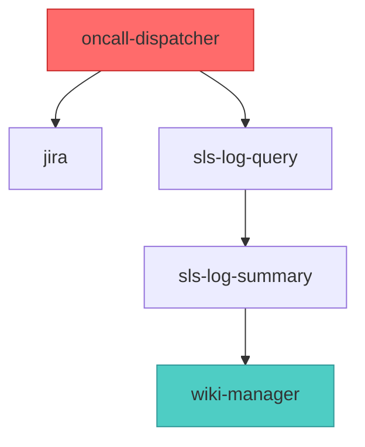

---
name: skill-dependency-analyzer
description: 分析所有技能之间的依赖关系 - 检测循环依赖、多路径问题，生成可视化图表（Mermaid/ASCII）和详细报告。当用户提到"技能依赖"、"分析技能"、"技能关系"、"循环依赖"、"技能图谱"、"可视化技能"、"依赖报告"、"技能调用链"，或想了解技能之间如何交互时使用。也适用于调试技能编排问题、优化技能架构或记录技能生态系统。使用增量更新机制（速度提升 6-12 倍），仅分析变更的技能文件。---

# SKILL依赖分析器

自动分析技能之间的依赖关系，检测潜在问题，生成包含可视化图表的综合报告。

## 为什么使用此分析器

理解技能依赖关系对于维护健康的技能生态系统至关重要。循环依赖可能导致无限循环，多路径依赖可能表明架构问题，孤立技能可能是待删除的候选项。此分析器帮助你：

- 在运行时问题发生前识别有问题的依赖模式
- 可视化技能架构以理解编排流程
- 追踪哪些技能最关键（高入度 = 多个依赖者）
- 通过检测冗余依赖路径优化性能

## 执行工作流

### 步骤 1：定位技能文件

分析器通过检查多个位置自动检测技能目录，**支持 Windows / macOS / Linux**：

**通用路径（所有平台）：**
1. `~/.claude/skills`（Claude Code 标准安装位置）

**Windows 专用路径（按优先级）：**
2. `%USERPROFILE%\.claude\skills`（等同于上方 ~ 路径）
3. `%APPDATA%\Claude\skills`
4. `%LOCALAPPDATA%\Claude\skills`

**macOS 专用路径：**
2. `~/Library/Application Support/Claude/skills`

**相对路径（任意平台兜底）：**
5. `./skills`（当前目录）
6. `../skills`（父目录）
7. 此技能本身的父目录

启动时会打印运行平台和实际使用的扫描目录：

```
🔍 SKILL 依赖关系分析器
🖥️  运行平台: Windows
📂 扫描目录: C:\Users\xxx\.claude\skills
```

你也可以指定自定义路径：

```bash
python3 src/main.py --skills-dir /path/to/your/skills
```

### 步骤 2：增量更新检测

分析器使用本地缓存追踪文件变更。缓存位置自动确定：

- **优先级 1**：项目内部 `.cache/` 目录（随技能一起移植）
- **优先级 2**：全局 `~/.claude/skill-dependency/` 目录（备用）

这种双缓存策略确保技能在任何环境下无需配置即可工作：

```python
# 缓存自动管理 - 无需设置
# 文件哈希（SHA-256）高效检测变更
```

### 步骤 3：运行分析器

**零配置模式**（自动检测所有内容）：

```bash
cd skill-dependency-analyzer
python3 src/main.py
```

**自定义配置**：

```bash
python3 src/main.py \
  --skills-dir /custom/path/to/skills \
  --output-dir ./reports \
  --cache-dir ./my-cache \
  --mode incremental
```

如需完全重建（在重大变更后有用），使用 `--mode full`。

### 步骤 4：查看生成的报告

分析器生成三个关键输出：

1. **skill-dependency-report.md** - 人类可读的分析报告，包含：
   - 执行摘要（循环依赖数、多路径依赖数、孤立技能）
   - 依赖关系图可视化（Mermaid + ASCII）
   - 按重要性排序的顶级技能（PageRank、入度、出度）
   - 优化建议

2. **缓存目录**（自动选择）：
   - `skill-index.json` - 用于增量更新的持久化索引
   - `graph.pkl` - 缓存的依赖关系图（NetworkX DiGraph）
   - `reports/` - 带时间戳的历史报告

3. **输出目录**（默认：当前目录）：
   - `skill-dependency-report.md` - 最新报告

### 步骤 5：呈现关键发现

为用户总结最重要的发现：

```
✅ 分析完成！（1.2秒，增量更新）

关键发现：
- ✅ 未检测到循环依赖
- 5 对技能存在多路径（菱形依赖）
- oncall-dispatcher 是最核心的编排器（出度：5）

完整报告：skill-dependency-report.md
```

如果发现循环依赖，立即突出显示，因为它们需要紧急处理。

## 依赖检测规则

解析器使用多种模式识别依赖关系，以处理不同的文档风格：

### 中文模式
- 模式：调用 + 技能名称 + skill
- 模式：使用 + 技能名称 + skill
- 模式：编排 + 技能列表（逗号分隔）
- 模式：配合 + 技能名称 + skill

### 英文模式
- 模式：call + 技能名称 + skill
- 模式：use + 技能名称 + skill
- 模式：invoke + 技能名称 + skill

### 代码模式
- 模式：Skill(skill="技能名称")
- 模式：Task(subagent_type="技能名称")

解析器从反引号中提取技能名称，处理逗号分隔的列表，并过滤掉"skill"和"skills"等噪音词。

## 分析指标

### 节点级指标

- **入度**：有多少技能依赖此技能（越高 = 越关键，变更影响更多技能）
- **出度**：此技能调用多少其他技能（越高 = 编排器/协调器角色）
- **PageRank**：考虑整个图结构的综合重要性评分（Google 算法）

### 图级指标

- **节点数**：技能总数
- **边数**：依赖关系总数
- **密度**：图的互联程度（0 = 无连接，1 = 完全连接）
- **最大深度**：最长依赖链（深链可能影响性能）
- **孤立节点**：无依赖关系的技能（待删除或集成的候选项）

### 问题检测

**循环依赖**（严重）
- 直接循环：A → B → A
- 间接循环：A → B → C → A
- 自循环：A → A

循环依赖可能导致无限递归，必须立即修复。

**多路径依赖**（警告）
- 菱形模式：A → B → D 和 A → C → D
- 两个技能之间的多条路径

多路径依赖通常无害，但可能表明冗余编排。

**热门技能**（监控）
- 入度 > 5：许多技能依赖此技能
- 对热门技能的变更影响广泛，需要仔细测试

**孤立技能**（审查）
- 无传入或传出依赖
- 可能未使用、已弃用或独立工具

## 可视化格式

### Mermaid 流程图

分析器生成 Mermaid 图表，显示前 15-20 个最重要的技能（按 PageRank 排序）：



PageRank 最高的技能用红色突出显示，最低的用青色显示。

### ASCII 树状图

为了快速在终端查看，分析器生成 ASCII 树状图，显示前 5 个编排器技能：

```
oncall-dispatcher (出度: 5)
├── jira
├── sls-log-query
│   └── sls-log-summary
│       └── wiki-manager
├── apollo-query
└── database-query
```

树状图限制为 3 层深度以防止混乱。

## 性能特征

- **首次扫描**（100 个技能）：约 10 秒（完整解析 + 图构建）
- **增量更新**（5 个变更技能）：约 1-2 秒（速度提升 6-12 倍）
- **增量更新**（无变更）：约 0.5 秒（缓存命中）

增量更新机制使此技能适合在开发过程中频繁使用。

## 可移植性与独立性

此技能设计为完全可移植和自包含：

**零配置**：无需设置。分析器自动：
- 在多个标准位置检测技能目录
- 根据需要创建缓存目录
- 优雅地处理缺失的依赖项

**灵活缓存**：使用双缓存策略：
- 项目内部 `.cache/`（复制技能时随之移动）
- 全局 `~/.claude/skill-dependency/`（系统级使用的备用）

**无外部依赖**：仅需要：
- Python 3.7+
- NetworkX 库（`pip install networkx`）

**随处可用**：可以：
- 复制到任何目录并立即运行
- 通过 CLI 用作独立工具
- 作为 Claude Code 技能调用
- 打包并作为插件分发

## 重要说明

**避免循环调用**：分析器不应被其他技能调用，以防止元循环依赖。

**缓存失效**：如果手动编辑索引或图缓存文件，使用 `--mode full` 从头重建。

**大型技能集**：对于超过 100 个技能的仓库，分析器在初始扫描期间显示进度条。

**报告归档**：历史报告自动保存到缓存目录的 `reports/` 子目录，带时间戳用于趋势分析。

**可移植性**：将此技能移动到另一台机器：
1. 复制整个 `skill-dependency-analyzer/` 目录
2. 运行 `pip install -r requirements.txt`
3. 执行 `python3 src/main.py` - 它将自动检测所有内容
